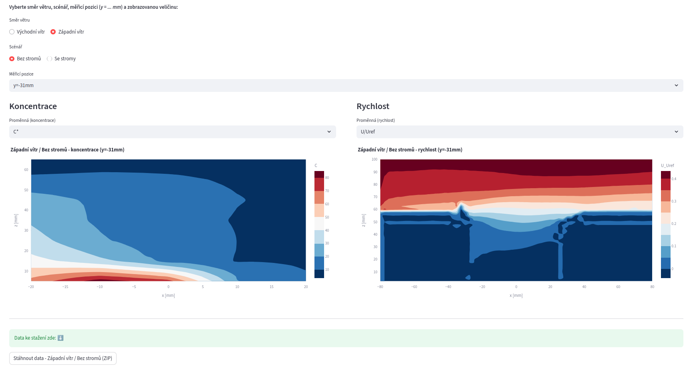

# Wind Tunnel Field Viewer

Interactive Python **Dash web application**  for visualization and download of **mean concentration and velocity fields** from wind-tunnel experiments.

---

## ✨ Main Features

- Interactive visualization of:
  - **mean concentration fields** (`C`, `C* std`)
  - **mean velocity fields** (`U/Uref`, `W/Uref`, `TKE/Uref²`)
- Automatic detection of:
  - x–z measurement planes
  - appropriate axis limits and aspect ratio
- Support for **East / West wind directions**
- Scenarios **with / without trees**
- Automatic pairing of concentration and velocity datasets by measurement position (`y=…mm`)
- One-click download of all data for the selected wind direction (ZIP archive)
- Czech user interface with internally consistent English dataset naming

---

## 📸 Screenshot



---

## 📦 Requirements

- Python ≥ 3.9  
- Dash  
- Streamlit
- Pandas  
- Plotly  

---

## 🧰 Installation

```bash
pip install dash streamlit pandas plotly
```

---

## 🧪 Running
**1) Dash**

Run from the repository root directory:
```bash
python tunnel-data-dash.py
```

and then open the app in a web browser:
```bash
http://localhost:8050/
```

**2) Streamlit**

Or, if using streamlit variant, run from the repository directory:
```bash
streamlit run tunnel-data-streamlit.py
```

---

## 📜 License
MIT License.  

---
